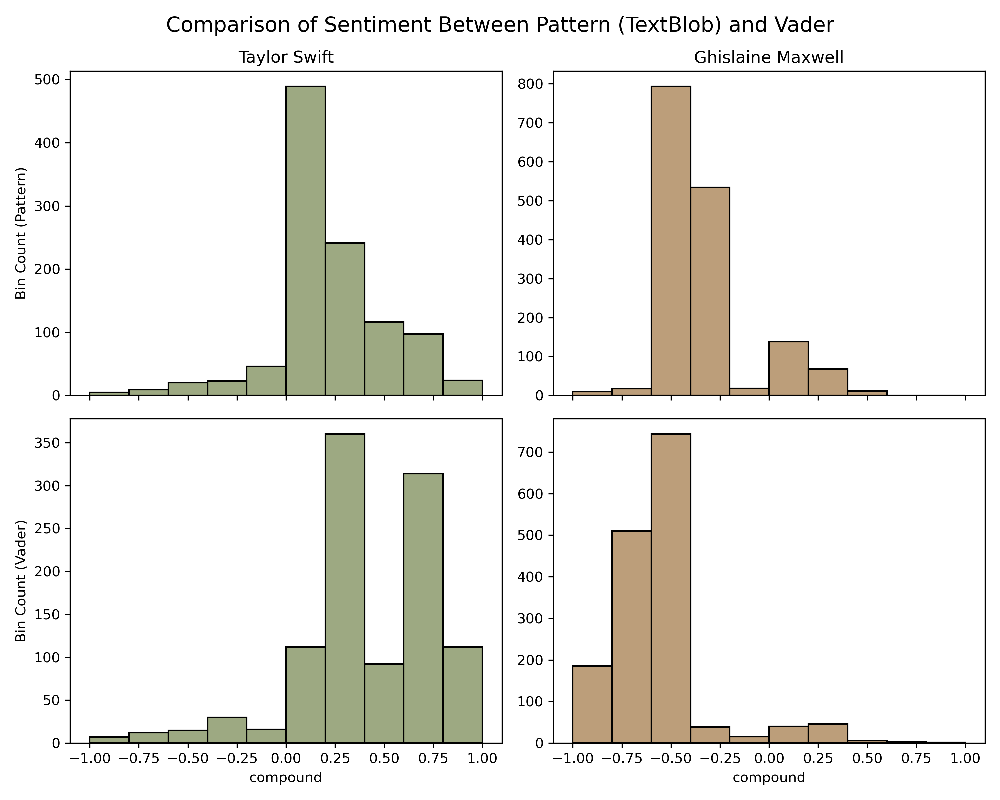

# SentimentAnalysis
 
Sentiment analysis helps understand the tone of text data, positive, negative, or neutral. Capturing sentiment can help organizations better understand the Voice of Customer (VOC) and even direct product development to improve functionality.

